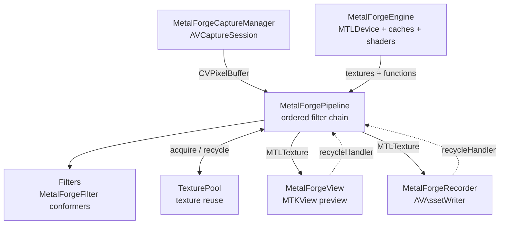

# Architecture

A high-level view of how MetalForge is put together. For the per-frame data flow
see [`PIPELINE.md`](PIPELINE.md); for a file-by-file map see
[`FILE_MAP.md`](FILE_MAP.md).

## Overview

MetalForge turns live `CVPixelBuffer`s (from the camera or a video source) into
GPU textures, runs them through an ordered chain of Metal compute filters, and
hands the result to an on-screen preview and/or a recorder. The pieces are
deliberately decoupled so you can use capture, processing, preview, and
recording together or independently.

## Component graph

## Main components

### MetalForgeEngine

Owns the shared GPU resources: the `MTLDevice`, command queue, the
`CVMetalTextureCache`(s), and shader-library loading. It vends Metal functions
(`makeFunction(name:)`, `makeFunction(name:constantValues:)`) and wraps
`CVPixelBuffer`s as `MTLTexture`s (`makeTexture(from:planeIndex:)`,
`makeTextures(...)`). All filters share one engine.

### MetalForgePipeline

Holds the ordered filter chain and drives per-frame processing. On each
`process(pixelBuffer:)` it auto-detects the input pixel format and inserts the
needed conversion stages (YUV→RGB, HDR decode/encode) around the user filters.
It acquires intermediate textures from the `TexturePool` and exposes
`recycle(_:)` so consumers can return textures when done.

### Filters

Small types conforming to `MetalForgeFilter`, each backed by a Metal compute
kernel. Source filters (`MetalForgeSourceFilter`, e.g. `YUVToRGBConverter`) sit
at index 0 and consume planar camera input; ordinary filters transform an RGB
working-space texture. A filter's `encode(...)` runs on the pipeline's
processing queue and must not commit or wait on the command buffer.

### TexturePool

Recycles intermediate `MTLTexture`s keyed by descriptor so the per-frame path
avoids repeated allocation. Textures are returned explicitly via
`recycle(_:)` / `recycleHandler`.

### Preview and recording

`MetalForgeView` is an `MTKView` subclass that presents a processed texture;
`MetalForgeViewRepresentable` wraps it for SwiftUI. `MetalForgeRecorder` writes
processed frames through `AVAssetWriter` with optional best-effort passthrough
audio. Both expose a `recycleHandler` so a shared frame is only reclaimed once
both consumers are finished with it.

## Shader library loading (SwiftPM and Xcode)

Shader loading is centralized in `MetalForgeEngine`. Under Xcode, the `.metal`
sources are precompiled into a `default.metallib` and loaded with
`makeDefaultLibrary(bundle: .module)`. Under SwiftPM / CI, the `.process`
resource rule copies the raw `.metal` files, so the engine falls back to
compiling each source at runtime with `makeLibrary(source:options:)`. The same
package therefore works under both toolchains without hardcoded paths.

## Color spaces

The pipeline supports an SDR path (BT.709) and an HDR-oriented path (BT.2100
PQ / HLG). For HDR sources the engine inserts an `HDRDecodeFilter` (PQ/HLG →
linear scene light) before the user filters and an `HDREncodeFilter` (linear →
PQ/HLG) after them, so user filters operate in a consistent working space.

## Concurrency

Frame processing happens on a dedicated processing queue, never the main thread.
`MetalForgeView` is `@MainActor` and must be touched from the main thread for
`present(texture:)`. Shared GPU-owning types are `@unchecked Sendable` because
their Metal resources are thread-safe for the access patterns used here.
