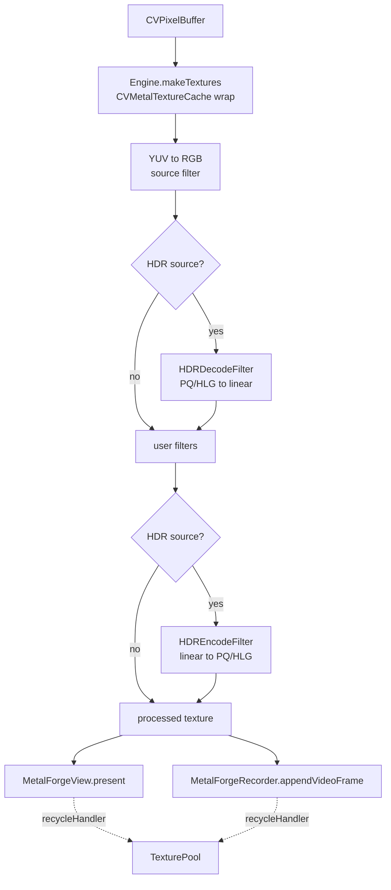

# Frame Processing Pipeline

How a single frame travels from a camera buffer to the screen and/or a file. For
the component overview see [`ARCHITECTURE.md`](ARCHITECTURE.md).

## Stages

1. **Input** — a `CVPixelBuffer` arrives (e.g. from an `AVCaptureSession` video
   output delegate, surfaced by `MetalForgeCaptureManager.onVideoFrame`).
2. **Texture wrapping** — `MetalForgeEngine` wraps the buffer's planes as
   `MTLTexture`s through a `CVMetalTextureCache`, so the GPU reads the same
   IOSurface the camera produced (zero-copy, no CPU round-trip).
3. **YUV → RGB** — bi-planar camera YUV is converted into the RGB working space
   by a source filter (`YUVToRGBConverter`), inserted automatically.
4. **HDR decode** *(HDR sources only)* — `HDRDecodeFilter` maps PQ/HLG to linear
   scene light so filters operate in a consistent space.
5. **User filters** — the ordered chain runs, each filter encoding its compute
   kernel into the shared command buffer and writing to a pooled destination
   texture.
6. **HDR encode** *(HDR sources only)* — `HDREncodeFilter` maps linear back to
   PQ/HLG for display or file output.
7. **Output** — the processed `MTLTexture` is returned from
   `process(pixelBuffer:)`. The caller presents it via `MetalForgeView` and/or
   appends it to `MetalForgeRecorder`.
8. **Recycling** — once preview and recorder are done with a texture, their
   `recycleHandler` returns it to the `TexturePool` for reuse.

Conversion and HDR stages are inserted by the pipeline based on the input pixel
format; user code only appends the filters it wants.

## Flow diagram

## Command buffer ownership

The pipeline creates and owns the command buffer for a frame. Each filter
**encodes** into it but must not commit or wait — that is the pipeline's job.
This keeps all stages of a frame on a single command buffer and lets the
pipeline schedule completion and recycling correctly.

## Texture recycling contract

Intermediate textures come from the `TexturePool`. A processed texture may be
consumed by both the preview and the recorder, so it is only recycled once
**both** consumers signal completion through their `recycleHandler`. Failing to
wire a `recycleHandler` back to `pipeline.recycle(_:)` leaks pooled textures.

## Recording

`MetalForgeRecorder` appends processed video frames via `AVAssetWriter`
(`appendVideoFrame(texture:presentationTime:)`) and optional audio samples
(`appendAudioSample(_:)`). Passthrough audio is attached best-effort: if the
writer cannot add the nil-settings audio input, recording proceeds video-only
rather than failing.
